<link rel="stylesheet" href="https://cdn.jsdelivr.net/npm/katex@0.10.2/dist/katex.min.css" integrity="sha384-yFRtMMDnQtDRO8rLpMIKrtPCD5jdktao2TV19YiZYWMDkUR5GQZR/NOVTdquEx1j" crossorigin="anonymous">

# **What is Reinforcement Learning?**

We’ve previously discussed supervised learning, used for tasks where our data is labeled or has true values, and unsupervised learning, used to discover patterns or relationships in unlabeled data. The last major pillar of machine learning is Reinforcement Learning, which is used to solve problems for which we don’t have examples of gold-standard outcomes. Unlike supervised learning, where we train our model using comparisons to true outcome values, reinforcement learning involves the use of numerical rewards and punishments to train our model. 

For our final project, we created a reinforcement learning model using Deep Q-Learning that takes in medical information from simulated sepsis patients and makes a series of treatment decisions to stabilize said patient. Before discussing the specifics of our model implementation, let’s review some reinforcement learning basics in the context of the problem we want to solve with our project. 

The most basic type of reinforcement learning has 4 elements: 
1. **Agent:** The agent is the decision-making model that interacts with our environment. In our case, this is our Deep Q-Network that takes in information about an environment, called a state, and selects an action based on the information in that state. This agent will then over time learn from the feedback it receives in the form of rewards or punishments.
2. **Environment:** The environment in our model is the simulated patient, with a state that contains information concerning patient vitals (such as their blood pressure, temperature, or heart rate), as well as patient demographics when they enter the treatment facility. After each action the agent takes, the environment’s state changes accordingly. 
3. **Actions:** A set of actions that the agent can take. In our case, the model can take five possible actions: administer antipyretics, antibiotics, fluids, vasopressors, or oxygen therapy. The goal of reinforcement learning is to train the model such that the action it takes in response to an input state is the optimal action for that situation. For example, if the input state to our model was a patient with a high fever, our goal would be for the model to take the action: administer antipyretics. 
4. **Reward:** After an action transitions the environment from state $$s$$ to state $$s’$$, the model receives a reward (or punishment) depending on whether $$s’$$ is a desired outcome or not. In our model, the reward is set to 10 if an action leads to the patient being stabilized (stage 0), -10 if the patient is dead (as defined by vitals or the number of time steps the patient has spent with sepsis), and -1 if the patient is alive but not stabilized. These values were chosen to encourage the agent to quickly stabilize patients without overtreating. [1] [2]

Here’s a visualization of how the four elements interact with each other:

| <figure> 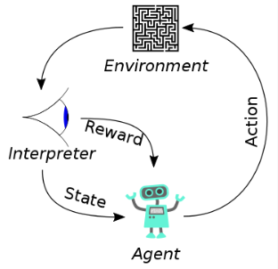 </figure> | 
|---| 
| *Figure 1* |

Now that we’ve provided a broad overview of the reinforcement learning paradigm, let’s discuss the specific type of reinforcement learning we use in our project: Deep Q-Learning.

# **What is Deep Q-Learning?**

Deep Q-Learning is a reinforcement learning algorithm that combines Deep Learning with Q-learning, an algorithm that learns to find optimal actions by estimating the maximum expected cumulative reward for each action in a given state, called the Q-values. The one setback with Q-learning is that estimating Q-values can become increasingly difficult as our task becomes more complex, this can be remedied by using a Deep Learning model to estimate our Q-values instead.

We decided to use DQL over other reinforcement learning algorithms as we want our agent to learn not just from what happened in the last iteration of the simulation, but from previous iterations as well. Other algorithms like transition probability-based models are appropriate when the environment we’re interacting with conforms to the Markov property, which can be represented by the following equation:

| <figure> 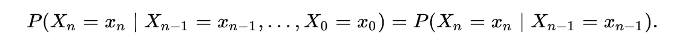  </figure> | 
|:--:| 
| *Figure 2* |

The Markov property says that given the current state of the environment, there’s a fixed probability of transitioning to any other state in the state space in the next time step and that it doesn’t matter what happened before the current state. Think about this formula in terms of a chess game. If the pieces are in a certain configuration, there’s a fixed set of possible moves for the next step (even though this set is very large), and it doesn’t really matter what sequence of moves got the chess board in this configuration. 

However, patient health isn’t like a simple game of chess. We not only want patients to recover, we want them to recover as fast as possible, which means it’s important to have prior information on what worked most efficiently. For example, if one patient was treated in 12 time steps using just antipyretics, but another was treated in 4 steps using a more aggressive treatment approach, we’d want the model to recall that and use that information to update its approach. As such, a transition probability-based model would not be appropriate for our context. 

## **Training**

| <figure> 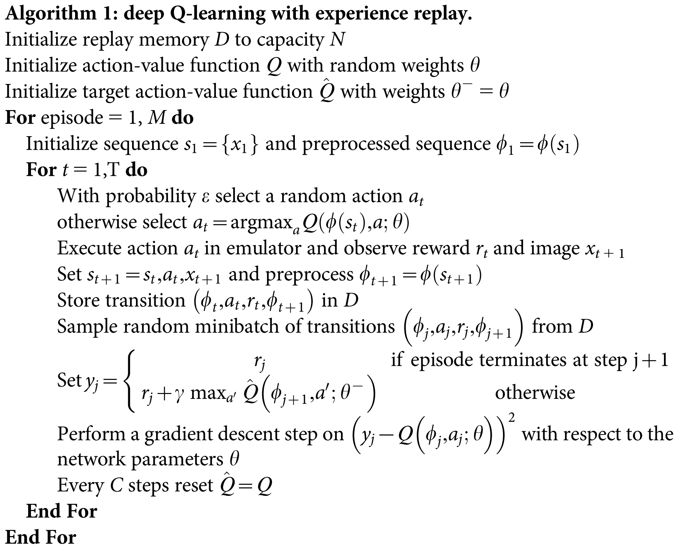 </figure> | 
|:--:| 
| *Figure 3* |

Pictured above in *Figure 3* is the algorithm that Deep Q-Learning uses to update model weights and teach the agent how to perform in the environment. Before delving into the specifics of the algorithm, let’s visualize broadly what is happening: 

| <figure> 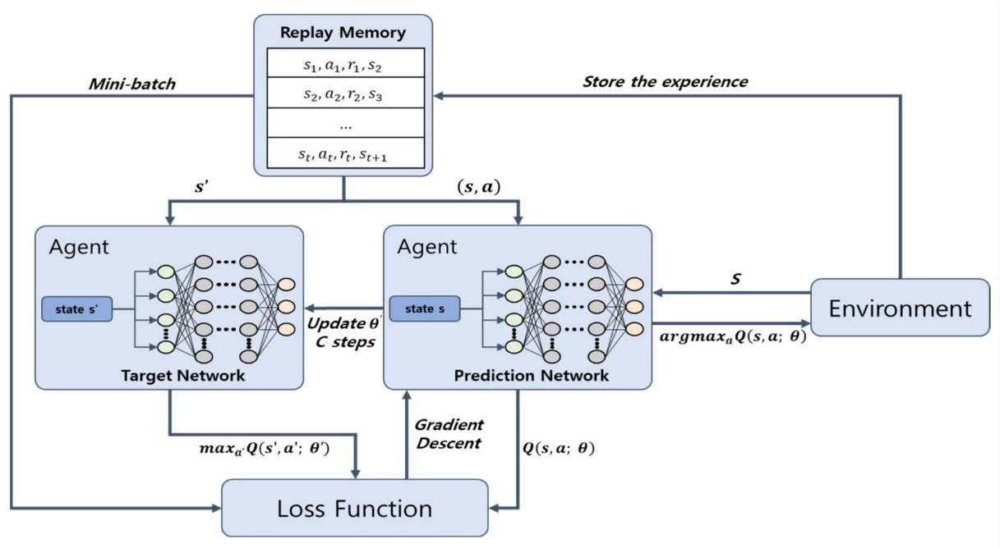 </figure> | 
|:--:| 
| *Figure 4* |

We start by initializing two networks, our target and prediction networks, using identical model architectures and randomly generated weights. We use the target network as a helper to ensure stability and prevent divergence in our prediction network during training. We also initialize a memory that with each iteration of the algorithm, will be populated with the following information: current state, action taken, reward received, state transitioned to via the action, and whether or not an episode is finished. An episode refers to one round of iterations; in our case, an episode corresponds to the treatment of a patient from start to finish, which involves multiple iterations of the algorithm or epochs. 

| <figure> 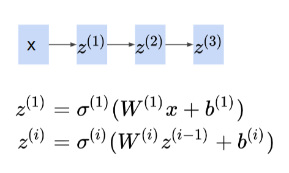 </figure> | 
|:--:| 
| *Figure 5* |

As the above picture shows, in a feedforward neural network, we input the starting data (our input state), it is multiplied by weights $$W$$, then passed through an activation function to get an output from the first layer. The process repeats, with each layer taking in as input the output from the previous layer. Although we start with our weights being randomly sampled, our goal is to update these weights with each epoch so the output becomes as accurate as possible using backpropagation and gradient descent. Now let’s dive into how we update our weights for a Deep Q-learning model. 

Since the model is dependent on using prior information, we have to figure out how we’re going to use the memory that we created for our model and has been populating throughout the runtime of the algorithm. Due to computation concerns, we must set a maximum size on the memory of the model, populating it with new memories and erasing the oldest. 

An intuitive assumption is that it’d be best for our agent to reference the entire content of the memory each time it has to make an evaluation using prior information. After all, humans tend to make wiser decisions the more experience they have to draw from. However, the issue is that at the beginning of the training process, when our model is exploring the state space, it is probably going to make a lot of bad decisions. Think about this: if you had a two-year-old choosing stocks for your retirement portfolio, their decisions would probably be as good as random at best. As such, rather than referencing the entire memory with each epoch, we choose a batch size of elements from the memory to sample for use in finding estimates of future rewards. Ideally, we choose our batch size so that it’s big enough to be representative of the memory and hopefully capture some episodes that were played fairly optimally, but small enough that the runtime of our algorithm training is reasonable. Once we have trained the agent for enough epochs such that the size of the memory is greater than the batch size, we can start sampling from the memory, and we do so for every following epoch during training. This process of randomly sampling past experiences from memory and training the model on these experiences is known as **experience replay**.

| <figure> 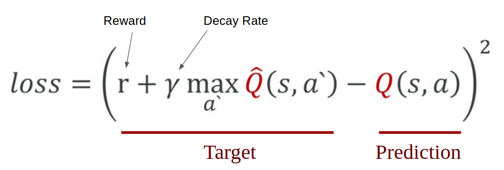 </figure> | 
|:--:| 
| *Figure 6* |

Experience replay iterates through the sampled memories and uses the formula pictured above to calculate our *loss* that we will use to update model weights, for our model we used **MSE** as our loss function. Let’s break down each of the key parameters. Firstly, $$r$$ refers to the rewards received after taking the chosen action. Next, the decay/discount rate, $$\gamma$$, is chosen depending on the specific problem you’re trying to solve. Since gamma weights our predictive estimates of the reward using prior information, setting a lower value for gamma (close to 0) tells the model that we only care about maximizing short-term reward, while setting a higher value (close to 1) prioritizes maximizing future/long-term gains. More concretely, if you were setting up a Deep Q-Learning algorithm to choose how to allocate your money in investments for your retirement, you’d want to set a very high value of gamma – since you’re not touching that money until the “long term,” maximizing future gains is much more important. Next are our estimated Q values $$\hat{Q}$$ represents the maximum Q-value estimated by our Target model, and $$Q$$ represents the value estimated by our prediction model. 

Additionally in our model, we also specify $$\alpha$$ and $$\epsilon$$. The learning rate $$\alpha$$ is set depending on how much the weights of the neural network are to be updated in response to our loss. $$\epsilon$$ refers to our exploration rate and allows us to balance between exploration and exploitation. When beginning training we start with an $$\epsilon$$ value close to one (exploration) that gradually decreases as we train (exploitation). At $$\epsilon = 1$$, we force the agent to take random actions in hopes that we will be able to explore our environment, while at $$\epsilon = 0$$ our agent is taking actions entirely based on prior information to exploit the environment. 

Now that we’ve gone over updating our model weights, why did we originally initialize two models? Going back to *Figure 5* the purpose of taking the difference between our target and predicted Q-values is to stabilize training, but how does it do this? During training our prediction model is updated after every epoch, however, we do not want to use the same approach for our target model. This is because, during the long training process, the agent may make many poor decisions while exploring the state space. To limit how much our prediction model is exposed to poor decision-making, we specify a period or number of epochs after which we update the weights in the target model to match the current weights in our prediction model. This allows the prediction model to learn from its mistakes while not passing those mistakes onto the target. By using two models, we can ensure that our final model is accurate while also being exposed to representative samples of data.

This process of interacting with the environment, storing memories, and training the model by replaying through previous experiences is how a Deep Q-Network learns and over time the agent will hopefully find optimal policies, in our case how to treat patients.[3] 

# **Application of DQL to Sepsis Patient Simulation**

Now that we’ve got the basics down, let’s take a look at our application of Deep Q-Learning to a sepsis patient simulation we created. Our idea was based on recent implementations of similar models. [4][5][6]

## **The Simulation**

The goal of our project is to create an agent that can take in a state containing a patient’s medical information, which includes their vitals and basic demographic information, as well as which stage of sepsis they are in, and take actions to stabilize them. We simulate patients with randomly assigned vitals, sex, and age. Then, depending on which stage of sepsis they are randomly assigned to, we update their vitals based on real-world documentation. [7] 

The agent has five treatment options to choose from, which were determined from common treatments for sepsis. [8] These include antipyretics, antibiotics, administration of fluids, vasopressors, and oxygen therapy. We programmed our patient simulation to update a patient’s vitals after an action is taken by the agent based on how the human body typically reacts to these treatments, and what stage of sepsis the patient is in. There is a degree of fiction in how these numbers were generated since it is impossible to model how each person will react to a given treatment *a priori*. To account for this randomness in how people respond to treatment, we program the simulation to update a patient’s vitals using a randomly generated number from a set of feasible values for which vitals could be updated. To make this more concrete, if a given patient is treated with an antipyretic, for example, we program the simulator to reduce their temperature value by a random number generated from the range 1 to 2 Celsius. The ranges for treatments were determined based on typical effects on patient vitals as well as a degree of creative license.

After each treatment, the simulation checks the vitals of the patient and what stage of sepsis they were in in the previous time-step and updates their diagnosis accordingly. The criteria for updating a diagnosis were drawn from the medical literature to reflect how real-world diagnoses of the various stages of sepsis are made. [9] Given this updated state of the patient, the agent is given a reward. If the patient is alive and stablized, the agent gets a reward of 10. If the patient is alive but still in one of the stages of sepsis, the model gets a reward of -1. If the patient passes away, the model gets a reward of -10. Using the loss function shown previously, the weights in the agent model are then updated, the results of the current epoch are stored in the memory, and the model begins the next epoch. 

## **Creating the Model**

Firstly, we had to determine our gamma value. We set gamma to .99 because our goal was to maximize long-term reward. In the context of our problem, we chose gamma to solve the following issue: in the early phases of training, we wanted the model to explore the various possibilities for actions to take in a variety of situations. The model quickly found that it is sometimes more “rewarding” to kill the patient early on in the process rather than try various treatments, accumulate negative rewards if the patient is not cured, then get a larger negative reward if the patient eventually passes away. For example, if the patient passes away within 2 epochs, that leads to a reward of -11, while if the patient is treated over 10 epochs and then passes away, that is a reward of -20, even though the model has learned more valuable information in the second case because it has learned what does not work. We wanted to ensure that the second scenario happened more often in the early phases of training, so we chose to set gamma close to 1.

Additionally, we initialize epsilon at 1 to allow for maximum exploration, then with each epoch of the algorithm, we multiply epsilon by .995 to gradually decrease it over the training period. This means that the further we are into the training process, the more the algorithm relies on using prior knowledge to guide its decisions.

For creating our target and prediction models, we decided to use Tensorflow in Python to initialize our neural network architectures. Our models use the following architecture, with Adam chosen as our chosen gradient descent algorithm: 

| <figure> 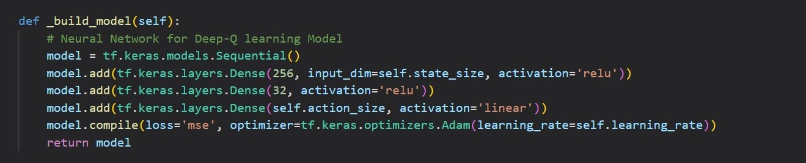  </figure> | 
|:--:| 
| *Figure 7* | 

We chose this model architecture after systematically testing different layer widths and model depths. We started with a very basic model of two layers each of width 16. After testing that model, as well as models with similarly simple architectures, we realized that we would need to significantly increase the width of our layers. The two metrics we used to initially compare our models were *% patients stabilized* and *average final reward*. These statistics were calculated and monitored across each 100 Episode period during training. Results of our evaluation are presented below for our four best models: 

| <figure> 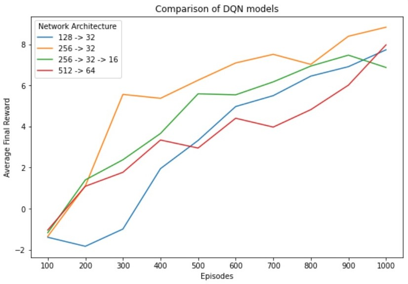  </figure> | 
|:--:| 
| *Figure 8* |

| <figure> 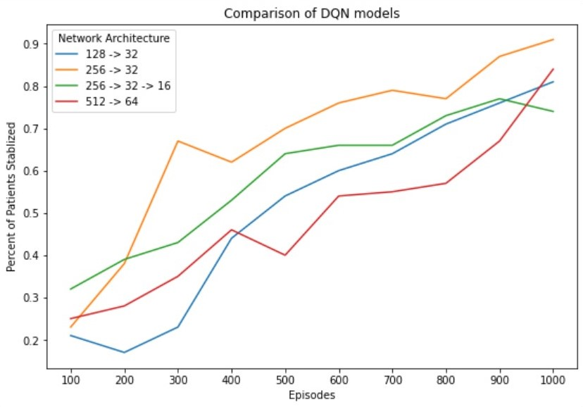  </figure> | 
|:--:| 
| *Figure 9* |

It was clear from these results that a model architecture of 2 hidden layers, with widths 256 and 32 respectively, was the best option. We’ll now refer to our best option model as “the model” for clarity. Below are the specific statistics for training this model, also including the average number of time steps taken before each episode ended.

<table>
  <tr>
    <th>Episode</th>
    <th>% Stabilized</th>
    <th>Avg. # Steps Taken</th>
    <th>Avg. Reward</th>
  </tr>
  <tr>
    <td>100</td>
    <td>23%</td>
    <td>9.28</td>
    <td>-1.35</td>
  </tr>
  <tr>
    <td>200</td>
    <td>38%</td>
    <td>8.45</td>
    <td>1.11</td>
  </tr>
  <tr>
    <td>300</td>
    <td>67%</td>
    <td>7.23</td>
    <td>5.56</td>
  </tr>
  <tr>
    <td>400</td>
    <td>62%</td>
    <td>8.02</td>
    <td>5.37</td>
  </tr>
  <tr>
    <td>500</td>
    <td>70%</td>
    <td>7.79</td>
    <td>6.25</td>
  </tr>
  <tr>
    <td>600</td>
    <td>76%</td>
    <td>7.15</td>
    <td>7.09</td>
  </tr>
  <tr>
    <td>700</td>
    <td>79%</td>
    <td>7.54</td>
    <td>7.51</td>
  </tr>
  <tr>
    <td>800</td>
    <td>77%</td>
    <td>7.69</td>
    <td>7.02</td>
  </tr>
  <tr>
    <td>900</td>
    <td>87%</td>
    <td>7.00</td>
    <td>8.39</td>
  </tr>
  <tr>
    <td>1000</td>
    <td>91%</td>
    <td>6.16</td>
    <td>8.83</td>
  </tr>
</table>

The final hyperparameter we had to choose was batch size. Like model depth and width, we chose batch size systematically by testing different batch sizes on our model. We chose a batch size of 64 to conduct our original model testing somewhat randomly; it is a power of 2, and we thought it would be both large enough to capture a representative sample from the memory and small enough to not extend the training time too much. However, using a batch size of 64 for our initial model evaluation meant that the training time was about half an hour for each model. As a result, we tried to systematically decrease the batch size and see if it would significantly affect the results. We report the results from a test on our final model architecture using a batch size of 32 below: 

<table>
  <tr>
    <th>Episode</th>
    <th>% Stabilized</th>
    <th>Avg. # Steps Taken</th>
    <th>Avg. Reward</th>
  </tr>
  <tr>
    <td>100</td>
    <td>25%</td>
    <td>9.63</td>
    <td>-1.31</td>
  </tr>
  <tr>
    <td>200</td>
    <td>18%</td>
    <td>7.26</td>
    <td>-4.60</td>
  </tr>
  <tr>
    <td>300</td>
    <td>16%</td>
    <td>7.57</td>
    <td>-5.45</td>
  </tr>
  <tr>
    <td>400</td>
    <td>19%</td>
    <td>6.93</td>
    <td>-4.40</td>
  </tr>
  <tr>
    <td>500</td>
    <td>23%</td>
    <td>6.32</td>
    <td>-4.14</td>
  </tr>
  <tr>
    <td>600</td>
    <td>27%</td>
    <td>6.07</td>
    <td>-3.25</td>
  </tr>
  <tr>
    <td>700</td>
    <td>18%</td>
    <td>7.21</td>
    <td>-3.88</td>
  </tr>
  <tr>
    <td>800</td>
    <td>36%</td>
    <td>5.53</td>
    <td>-2.17</td>
  </tr>
  <tr>
    <td>900</td>
    <td>37%</td>
    <td>7.64</td>
    <td>-0.62</td>
  </tr>
  <tr>
    <td>1000</td>
    <td>30%</td>
    <td>7.17</td>
    <td>-2.29</td>
  </tr>
</table>

A batch size of 128 extended the training time longer than was feasible, and we did not opt to test on a batch size of 16. This is because reducing the batch size to 32 significantly impeded performance, and we hypothesized that a batch size of 16 would only exacerbate this problem. 

Before finalizing our model, we needed to choose the optimal training time. If we don’t train the model for enough time, its predictive power will not be as strong, but train it too long and you run the risk of overfitting to the training environment. To choose the number of episodes we’d train the model for, we computed % stabilized and average final reward as moving averages over periods of 250 episodes. Results are reported in the table below: 

<table>
  <tr>
    <th>Episode</th>
    <th>% Stabilized</th>
    <th>Avg. # Steps Taken</th>
    <th>Avg. Reward</th>
  </tr>
  <tr>
    <td>250</td>
    <td>43%</td>
    <td>8.325</td>
    <td>1.94</td>
  </tr>
  <tr>
    <td>500</td>
    <td>68%</td>
    <td>6.715</td>
    <td>5.545</td>
  </tr>
  <tr>
    <td>750</td>
    <td>80%</td>
    <td>6.115</td>
    <td>7.065</td>
  </tr>
  <tr>
    <td>1000</td>
    <td>0.855</td>
    <td>6.185</td>
    <td>7.445</td>
  </tr>
  <tr>
    <td>1250</td>
    <td>93%</td>
    <td>6.435</td>
    <td>9.04</td>
  </tr>
  <tr>
    <td>1500</td>
    <td>87%</td>
    <td>6.28</td>
    <td>8.48</td>
  </tr>
  <tr>
    <td>1750</td>
    <td>83%</td>
    <td>6.905</td>
    <td>7.815</td>
  </tr>
  <tr>
    <td>2000</td>
    <td>81%</td>
    <td>5.835</td>
    <td>7.69</td>
  </tr>
</table>

Notice that after a training period of 1250 episodes, performance begins to drop off; the % stabilized reduces with each additional period of 250 episodes, and so does the average reward. This is most likely caused by *Catastrophic forgetting*, an issue in reinforcement learning that occurs when an agent begins performing poorly even while training in the same environment. This is different from overfitting as in reinforcement learning overfitting is reserved for when an agent performs poorly due to relying too heavily on the format of its training environment. From this, we determined that we would set our training time at 1250 episodes. 

## **Results**

After training our model we created a small program that would allow us to view in real-time the patient simulation environment and the actions taken by our agent to analyze its performance and observe behaviors in its treatment. Below are two clips of our trained agent treating two randomly generated patients presenting with Septic Shock:

| <figure> 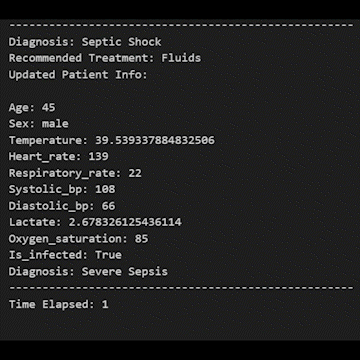  </figure> | <figure> 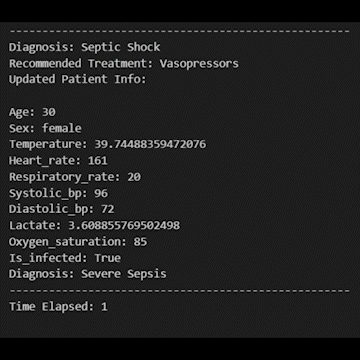  </figure> |
|:--:|:--:|
| *Figure 10* | *Figure 11* |

Additionally, to evaluate the performance of our model objectively, we compare the survival rates of patients who move through our simulation to real-world survival rates of patients who present with different stages of sepsis. 

<table>
    <caption>Our Model's Survival Statistics</caption>
  <tr>
    <th> Presenting Stage of Sepsis </th>
    <th>Stabilization Rate</th>
    <th>Mortality Rate</th>
    <th>Avg. # Steps Taken</th>
  </tr>
  <tr>
    <th>SIRS</th>
    <td>96%</td>
    <td>4%</td>
    <td>4.5</td>
  </tr>
  <tr>
    <th>Sepsis</th>
    <td>0.91</td>
    <td>0.09</td>
    <td>9.5</td>
  </tr>
  <tr>
    <th>Severe Sepsis</th>
    <td>86%</td>
    <td>14%</td>
    <td>12.4</td>
  </tr>
  <tr>
    <th>Septic Shock </th>
    <td>72%</td>
    <td>28%</td>
    <td>15.5</td>
  </tr>
</table>

<table>
  <caption>Mortality Rates in the Real World [10]</caption>
  <tr>
    <th>Time of Study</th>
    <th>SIRS</th>
    <th>Sepsis</th>
    <th>Severe Sepsis</th>
    <th>Septic Shock</th>
  </tr>
  <tr>
    <td>1995</td>
    <td>7%</td>
    <td>16%</td>
    <td>20%</td>
    <td>46%</td>
  </tr>
  <tr>
    <td>2006</td>
    <td>N/A</td>
    <td>1.3%</td>
    <td>9.2%</td>
    <td>28%</td>
  </tr>
</table>

As seen by both the clips and the overall results, our agent is fairly successful at treating patients and in general chooses optimal treatments to prevent patient death and stabilize the patient as quickly as possible. However, the agent does still fail to stabilize some patients as seen in *Figure 11*, in this clip the agent is unable to maintain the patient’s blood pressure within a healthy range for too long, eventually leading to their death. We can also see this in the average number of time steps taken in each episode where patients presenting with more severe cases of sepsis take dramatically longer to be stabilized.

## **Discussion**

While the outcomes for patients “treated” by our agent are comparable to, and in some cases better than, outcomes for real patients treated by real doctors, it’s important to remember this model is just a toy model. We attempt to simulate patient vitals so that they mirror real life to the extent possible, but there is an element of randomness in how the human body reacts to treatment that is impossible to capture with our simulation. Additionally, the actions taken by an agent or doctor in real life are far more complex than the simplified set we used in this example.

However, the broad results of our project are still very much encouraging. They suggest that given a larger, richer, training set that is more reflective of the dynamics of the human body, reinforcement learning models have the potential to act as a valuable supplement to existing healthcare systems. Overall this application of reinforcement learning was meant to convey its potential uses not just for patient treatment but for a variety of issues and problems. Currently, Deep Q-Networks along with more novel reinforcement learning algorithms such as Proximal Policy Optimization (PPO) are being used to optimize various tasks across different fields, including robotics, finance, healthcare, and even playing games.

# **Appendix**

[**Here**](https://github.com/Kdossal/PHP2650-FinalProj/blob/main/Code/PatientTreatment.ipynb) is the link to the main Jupyter Notebook we used to create our sepsis patient simulation and DQL Model, as well as code used to train, test, and visualize our agent’s performance. For this project, we chose to use **Python** since Tesorflow is originally built with Python in mind making training our model much more efficient. Additionally, Python was chosen as our DQN model and simulation both heavily made use of Object Oriented Programming (OOP). To run this code in R, you would need to install and use the Tensorflow package, along with reworking the Python code to either use OOP in R or by using a different data structure like lists to keep track of the simulation environment and DQN model.

# **References**
[1] Li, Yuxi. "Deep Reinforcement Learning: An Overview." arXiv preprint arXiv:1701.07274 (2017).

[2] Fatemi, Mehdi, et al. “Using Reinforcement Learning to Identify High-Risk States and Treatments in Healthcare.” Microsoft Research, 17 Aug. 2022, www.microsoft.com/en-us/research/blog/using-reinforcement-learning-to-identify-high-risk-states-and-treatments-in-healthcare/. 

[3] Tsoukalas, Athanasios et al. “From data to optimal decision making: a data-driven, probabilistic machine learning approach to decision support for patients with sepsis.” JMIR medical informatics vol. 3,1 e11. 24 Feb. 2015, doi:10.2196/medinform.3445

[4] Fatemi, Mehdi, et al. "Medical dead-ends and learning to identify high-risk states and treatments." Advances in Neural Information Processing Systems 34 (2021): 4856-4870.

[5] Gultepe, Eren et al. “From vital signs to clinical outcomes for patients with sepsis: a machine learning basis for a clinical decision support system.” Journal of the American Medical Informatics Association : JAMIA vol. 21,2 (2014): 315-25. doi:10.1136/amiajnl-2013-001815

[6] Polat, Gizem et al. “Sepsis and Septic Shock: Current Treatment Strategies and New Approaches.” The Eurasian journal of medicine vol. 49,1 (2017): 53-58. doi:10.5152/eurasianjmed.2017.17062

[7] Srzić, Ivana et al. “SEPSIS DEFINITION: WHAT'S NEW IN THE TREATMENT GUIDELINES.” Acta clinica Croatica vol. 61,Suppl 1 (2022): 67-72. doi:10.20471/acc.2022.61.s1.11

[8] Chakraborty, Rebanta K., and Bracken Burns. "Systemic inflammatory response syndrome." (2019).
